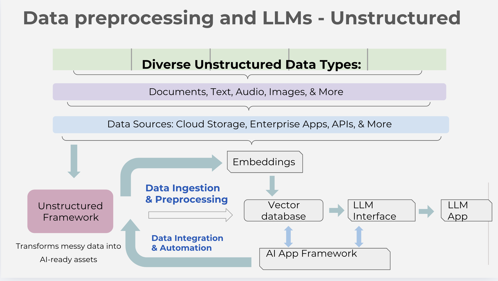
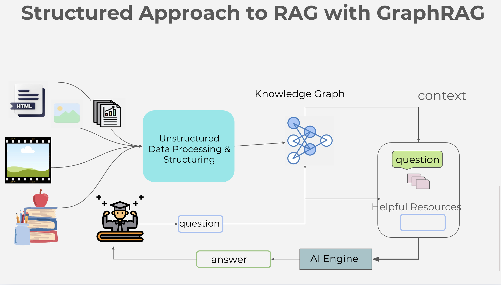

<!-- @format -->
--------------------

# Document Understanding and Retrieval Course

Welcome to the Data Preprocessing for LLMs! This repository contains the code and resources you'll need to follow along with the course.

# Unstructured Framework for Educational Content Processing

An end-to-end framework for transforming diverse unstructured educational content into AI-ready assets with rich metadata and embeddings.

## Project Overview

This framework transforms messy educational data into AI-ready assets by:
- Processing diverse unstructured data types (Documents, Text, Audio, Images)
- Generating rich metadata and embeddings
- Storing processed content in vector databases
- Providing an LLM interface for intelligent content retrieval
- Implementing automation for continuous processing




## Current Status

### ✅ Completed Components
- Base ContentProcessor abstract class
- PDF content processor implementation
- Vector storage integration with ChromaDB
- Core framework implementation
- LLM query interface
- Basic test framework setup

### 🚧 In Progress
- Enhancing PDF processor with key concept extraction
- Implementing content chunking strategies
- Adding support for additional content types
- Integrating with Streamlit interface
- Setting up comprehensive logging

## Architecture

The architecture follows a modular design with specialized processors for different content types, a unified processing pipeline, and integration with vector storage and LLM interfaces.

```
final_rag_sys/
├── processors/           # Content type processors
│   ├── base.py          # Abstract processor class
│   ├── pdf_processor.py # PDF specific processor
│   ├── text_processor.py
│   ├── audio_processor.py
│   └── image_processor.py
├── storage/             # Storage implementations
│   └── vector_store.py  # Vector database interface
├── framework.py         # Main framework class
├── llm_interface.py     # LLM query interface
├── tests/              # Test directory
└── streamlit_app.py    # Web interface
```

## Key Features

### Content Processing
- Extracts text from various content types
- Generates metadata and embeddings
- Implements content chunking for large documents
- Handles multilingual content

### Vector Storage
- Stores embeddings and metadata in ChromaDB
- Provides efficient retrieval mechanisms
- Implements caching for frequently accessed content

### LLM Interface
- Retrieves relevant content based on queries
- Generates contextual responses
- Handles context window optimization

## Getting Started

### Prerequisites
```bash
# Create virtual environment
python -m venv venv
source venv/bin/activate  # Unix
.\venv\Scripts\activate   # Windows

# Install dependencies
pip install -r requirements.txt
```

### Basic Usage
```python
from framework import UnstructuredFramework
from processors.pdf_processor import PDFProcessor

# Initialize framework
framework = UnstructuredFramework()
framework.register_processor("pdf", PDFProcessor())

# Process a document
with open("sample.pdf", "rb") as pdf_file:
    result = await framework.process_content(pdf_file, "pdf")
```

## Dependencies
- PyPDF2 for PDF processing
- sentence-transformers for embeddings
- chromadb for vector storage
- pytest for testing
- asyncio for async processing

## Roadmap

### Phase 1: Core Components (Current)
- [x] Base architecture implementation
- [x] PDF processing pipeline
- [x] Vector storage integration
- [ ] Enhanced metadata extraction
- [ ] Content chunking strategies

### Phase 2: Additional Processors
- [ ] Text file processor
- [ ] Audio transcription
- [ ] Image OCR
- [ ] Video processing

### Phase 3: Integration & Enhancement
- [ ] Streamlit interface
- [ ] Comprehensive logging
- [ ] Performance optimization
- [ ] Batch processing
- [ ] Automated testing

## Contributing

1. Fork the repository
2. Create your feature branch (`git checkout -b feature/AmazingFeature`)
3. Commit your changes (`git commit -m 'Add some AmazingFeature'`)
4. Push to the branch (`git push origin feature/AmazingFeature`)
5. Open a Pull Request

## License

This project is licensed under the MIT License - see the [LICENSE](LICENSE) file for details.

## Acknowledgments
- Built with PyPDF2 for PDF processing
- Uses sentence-transformers for embeddings
- Powered by ChromaDB for vector storage


